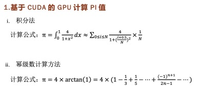
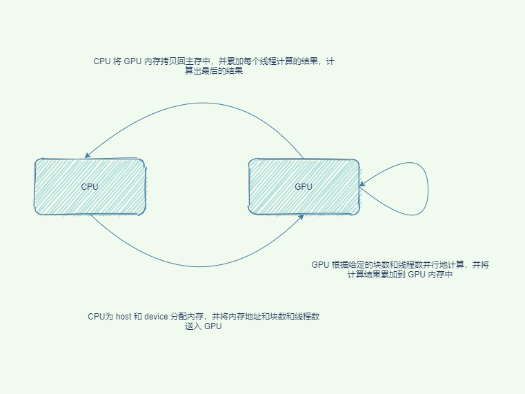
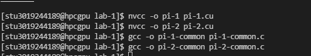
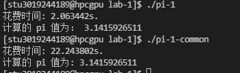
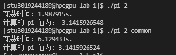

# 异构计算实验一 报告

**3019244189 齐呈祥**

## 实验内容

本次实验使用 CUDA 编程方法来计算 pi 的值，分别使用积分法和幂级数计算方法来计算 pi 的值，并通过 CUDA 修改 GPU 参数来测试性能，并同串行计算的性能比较计算加速比。

## 实验原理

基于 CUDA 的 GPU 计算 PI 值的数学原理如上图所示。CUDA 编程能为我们提供使用 GPU 进行计算和编程的能力，极大地提高了计算的效率。

## 程序流程图

程序执行的流程图如上图所示。  
   
具体来说，我们的程序首先为 CPU 和 GPU 分配内存，之后调用 GPU 函数并传入对应的参数并行计算，当 GPU 计算完成后，CPU 调用 cudaMemcpy API 将 GPU 内存拷贝回 CPU， CPU在对计算后的结果进行累加并得到最终的结果。

## 程序结果及分析

首先编译我们使用 C 语言编写的串行程序和使用 CUDA 编写的并行程序

接下来我们执行使用积分法计算 pi 值得串行程序的可执行文件以及使用 CUDA 编写的并行程序的可执行文件，以此来比较我们程序运行的性能，在两个程序我们使用了相同的迭代次数参数，都为 **N = 32 * 256 * 100000**，在串行程序中将作用域分为 N 份来进行串行处理，而在 CUDA 中则将其分为 32 个块，每个块 256 个线程，每个线程分别执行 100000 次浮点数计算。

从我们的实验结果来看，我们使用相同的参数计算出来的 pi 值的精度是相同的，然而执行时间上却拥有很大的差异，可以计算加速比得：

**加速比 =  22.24s / 2.06s = 10.80** 

可以看到，我们使用 CUDA 编程计算的加速比得效率已经超过了10，由此可见使用 CUDA 编程带来的性能提升是巨大的。

接下来我们使用 幂级数计算方法来分别执行串行程序和 CUDA 执行的程序，参数与上述相同：

**加速比 = 6.13s / 1.99s = 3.08**

性能也得到了一定程度的提升。

## 实验总结

在本次实验中，学习到了如何使用 CUDA 编写简单的并行程序，并将其与串行程序的性能进行比较，了解到了使用 CUDA 充分利用 GPU 性能能够大幅提升可并行化程序的性能。

