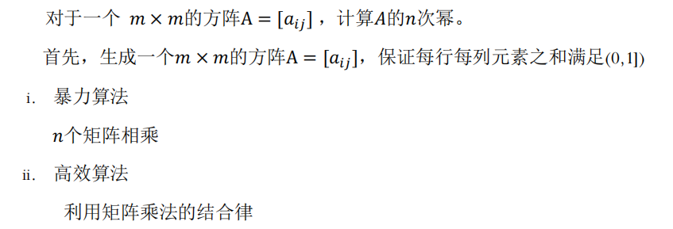
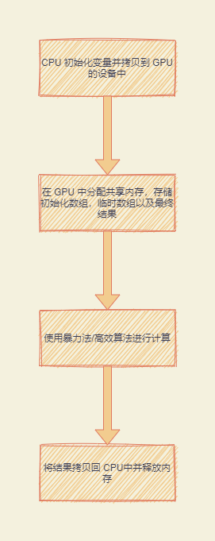
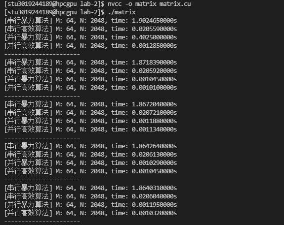

# 异构计算实验二 报告

### 基于 CUDA 的 GPU 实现矩阵的幂

**姓名：齐呈祥**

**学号： 3019244189**

**班级： 计科4班**

**邮箱： 18630816527@163.com**

## 实验内容

本次实验要求分别使用 CPU 和 GPU，分别使用暴力计算和结合律的优化算大，使用基于 GUDA 的 GPU 编程方法实现矩阵的幂并比较算法的效率。同时我们需要根据 CPU 和 GPU 计算的异同，学习如何利用 CUDA 在 GPU 上进行编程来进行高性能计算。



## 实验原理

### GPU 计算过程

- 将数据从 CPU 内存拷贝到 GPU 内存
- 加载 GPU 程序并执行，使用显存数据
- 将结果数据从 GPU 内存 拷贝回 CPU 内存

### 实验代码

**串行暴力算法：**

```c
void CPUMatrixPowerBrute() {
	clock_t start = clock();
	float h_matrix[M][M];
	for (int i = 0; i < M; i++) {
		for (int j = 0; j < M; j++) {
			h_matrix[i][j] = (float)rand() / RAND_MAX / (float)M;
		}
	}
	float h_matrix_result[M][M];
	float h_matrix_temp[M][M];
	memcpy(h_matrix_temp, h_matrix, M * M * sizeof(float));
	for (int i = 0; i < N; i++) {
		for (int j = 0; j < M; j++) {
			for (int k = 0; k < M; k++) {
				float value = 0.0;
				for (int l = 0; l < M; l++) {
					value += (h_matrix_temp[j][l] * h_matrix[l][k]);
				}
				h_matrix_result[j][k] = value;
			}
		}
		memcpy(h_matrix_temp, h_matrix_result, M * M * sizeof(float));
	}
	clock_t end = clock();
	double time = (double)(end - start) / CLOCKS_PER_SEC;
	printf("[串行暴力算法] M: %d, N: %d, time: %.10lfs\n", M, N, time);
}
```

在暴力算法中，我们直接按照传统的矩阵乘法进行三层循环求矩阵的值，并且一共循环执行 N 次表示进行 N 次矩阵乘法。


**并行暴力算法：**

```c
__global__ void GPUMatrixPowerBruteKernel(float* d_result) {
	__shared__ float matrixInit[d_M][d_M];
	__shared__ float matrixTemp[d_M][d_M];
	__shared__ float matrixResult[d_M][d_M];
	int index_x = threadIdx.x;
	int index_y = threadIdx.y;
	matrixInit[index_x][index_y] = *(d_matrix + index_x * blockDim.y + index_y);
	matrixTemp[index_x][index_y] = matrixInit[index_x][index_y];
	__syncthreads();
	for (int i = 1; i < d_N; i++)
	{
		float tempResult = 0.0;
		for(int j = 0; j < d_M; j++)
		{
			tempResult += matrixTemp[index_x][j] * matrixTemp[j][index_y];
		}
		matrixResult[index_x][index_y] = tempResult;
		__syncthreads();
		matrixTemp[index_x][index_y] = matrixResult[index_x][index_y];
		__syncthreads();
	}
	*(d_result + index_x * blockDim.y + index_y) = matrixResult[index_x][index_y];
}

void GPUMatrixPowerBrute()
{
	clock_t start = clock();
	int h_M = M;
	int h_N = N;
	float* h_matrix;
	cudaMallocHost(&h_matrix, M * M * sizeof(float));
	cudaMallocManaged(&result, M * M * sizeof(float));

	for (int i = 0; i < M; i++) {
		for (int j = 0; j < M; j++) {
			*(h_matrix + (M * i + j)) = rand() / (float)M;
		}
	}
	cudaMemcpyToSymbol(d_matrix, h_matrix, M * M * sizeof(float));
	cudaMemcpyToSymbol(&d_M, &h_M, sizeof(int));
	cudaMemcpyToSymbol(&d_N, &h_N, sizeof(int));

	dim3 threads(M, M);
	GPUMatrixPowerBruteKernel << <1, threads >> > (result);
	cudaDeviceSynchronize();
	// 输出结果
	cudaFreeHost(h_matrix);
	cudaFree(result);
	clock_t end = clock();
	double time = (double)(end - start) / CLOCKS_PER_SEC;
	printf("[并行暴力算法] M: %d, N: %d, time: %.10lfs\n", M, N, time);
}
```

在并行暴力算法中，我们使用每个线程来计算矩阵一个位置的最终结果，在每次迭代后都会进行同步，等待所有线程计算完第一次迭代后再同时进入下一次迭代。

**串行高效算法：**

```c
void CPUMatrixPowerEfficient() {
	clock_t start = clock();
	float h_matrix[M][M];
	for (int i = 0; i < M; i++) {
		for (int j = 0; j < M; j++) {
			h_matrix[i][j] = (float)rand() / RAND_MAX / (float)M;
		}
	}
	float h_matrix_result[M][M];
	float h_matrix_temp[M][M];
	memcpy(h_matrix_temp, h_matrix, M * M * sizeof(float));
	for (int i = 1; i < N; i *= 2) {
		for (int j = 0; j < M; j++) {
			for (int k = 0; k < M; k++) {
				float value = 0.0;
				for (int l = 0; l < M; l++) {
					value += (h_matrix_temp[j][l] * h_matrix_temp[l][k]);
				}
				h_matrix_result[j][k] = value;
			}
		}
		memcpy(h_matrix_temp, h_matrix_result, M * M * sizeof(float));
	}
	clock_t end = clock();
	double time = (double)(end - start) / CLOCKS_PER_SEC;
	printf("[串行高效算法] M: %d, N: %d, time: %.10lfs\n", M, N, time);
}
```

在高效矩阵算法中，我们运用了矩阵的结合律，每次迭代都复用上一次迭代的结果而不重新迭代，可以将迭代次数下降到 log n


**并行高效算法：**

```c
__global__ void GPUMatrixPowerEfficientKernel(float* d_result) {
	__shared__ float matrixTemp[d_M][d_M];
	__shared__ float matrixResult[d_M][d_M];
	int index_x = threadIdx.x;
	int index_y = threadIdx.y;
	matrixTemp[index_x][index_y] = *(d_matrix + index_x * d_M + index_y);
	__syncthreads();
	for(int c = 1; c < d_N; c *= 2)
	{
		float result = 0.0;
		for (int i = 0; i < d_M; i++)
		{
			result += matrixTemp[index_x][i] * matrixTemp[i][index_y];
		}
		matrixResult[index_x][index_y] = result;
		__syncthreads();
		matrixTemp[index_x][index_y] = matrixResult[index_x][index_y];		
		__syncthreads();
	}
	*(d_result + index_x * blockDim.y + index_y) = matrixResult[index_x][index_y];
}

void GPUMatrixPowerEfficient() {
	clock_t start = clock();	
	int h_M = M;
	int h_N = N;
	float* h_result;
	float* d_result;
	float* h_matrix;
	size_t pitch;
	cudaMallocHost(&h_result, M * M * sizeof(float));
	cudaMallocPitch(&d_result, &pitch, M * sizeof(float), M);
	cudaMallocHost(&h_matrix, M * M * sizeof(float));
	for (int i = 0; i < M; i++) {
		for (int j = 0; j < M; j++) {
			*(h_matrix + i * M + j) = rand() / (float)M;  
		}
	}
	cudaMemcpyToSymbol(&d_M, &h_M, sizeof(float));
	cudaMemcpyToSymbol(&d_N, &h_N, sizeof(float));
	cudaMemcpyToSymbol(d_matrix, h_matrix, M * M * sizeof(float));
	cudaMemcpy2D(d_result, pitch, h_result, pitch, M * sizeof(float), M, cudaMemcpyHostToDevice);
	dim3 threads(M, M);
	GPUMatrixPowerEfficientKernel<<<1, threads>>>(d_result);
	cudaDeviceSynchronize();
	cudaMemcpy2D(h_result, pitch, d_result, pitch, M * sizeof(float), M, cudaMemcpyDeviceToHost);
	cudaFreeHost(h_matrix);
	cudaFreeHost(h_result);
	cudaFree(d_result);
	clock_t end = clock();
	double time = (double)(end - start) / CLOCKS_PER_SEC;
	printf("[并行高效算法] M: %d, N: %d, time: %.10lfs\n", M, N, time);
}
```

并行高效算法每次迭代时都复用中间临时矩阵而不使用初始化的矩阵，大大降低了复杂度，同时使用 CUDA 并行地计算矩阵的每一个位置，最终也加快了算法的速度。


## 程序流程图





## 实验结果及分析

### 实验结果

我们将上述算法同时执行了五次并记录了所需时间，结果如下图所示:



我们统计了数据如下表所示：

**暴力法**

|             | CPU      | GPU      |
| ----------- | -------- | -------- |
| 平均时间(s) | 1.87s    | 0.40s    |
| M, N        | 64, 2048 | 64, 2048 |

**结合律法:**

|             | CPU      | GPU      |
| ----------- | -------- | -------- |
| 平均时间(s) | 0.0206s  | 0.0011s  |
| M, N        | 64, 2048 | 64, 2048 |

**加速比：**

|        | 暴力法 | 结合律法 |
| ------ | ------ | -------- |
| 加速比 | 4.68   | 18.73    |


### 结果分析

- 根据我们的结果可以看出，无论是串行还是并行的程序，运用了乘法结合律的算法都要比直接暴力算法要快得多，证明我们的算法足够高效
- 使用同样的算法，直接在 CPU 上串行执行和使用 GPU 并行执行也会有很大的性能差距，无论是暴力法还是结合律算法都将执行时间缩短了数倍乃至十数倍。我们在程序中大量使用 `shared memory` 也会加大快 GPU 访问与写入内存的速度。


## 实验总结

在本次实验中，使用 CUDA 实现了一个相比第一次实验更为复杂的算法实现，在本次实验中，我学习到了如何在 GPU 中分配 shared memory, const memory 以及如何在 GPU 中进行线程间的同步与通信，帮助我更进一步学习了如何使用 CUDA 在 NVIDIA GPU 上进行高性能编程，更加深刻地理解了 GPU 体系结构的模型。