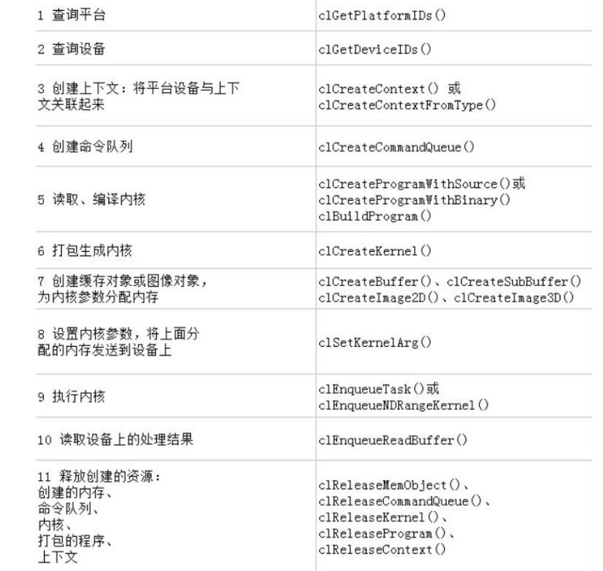

# 异构计算实验三报告

## 基于 OpenCL 的 GPU/多核CPU实现矩阵的幂

**姓名：齐呈祥**

**学号： 3019244189**

**班级： 计科4班**

**邮箱： 18630816527@163.com**

## 实验内容
本次实验要求使用 OpenCL, 分别使用暴力法和结合律的方法，以及多核 CPU 与 GPU 分别作为 device，计算矩阵的幂   
  
    
   

比较 OpenCL 使用多核CPU计算和使用GPU计算的异同，在速度上的差别，学习 OpenCL 编程的方法，掌握利用 OpenCL 进行计算，从而在之后编程中可以使用 OpenCL 进行并行编程的加速。

## 实验原理
### OpenCL 程序基本结构


### OpenCL 计算过程
1. 获取平台和平台上的设备
2. 在设备上创建上下文，在上下文创建命令队列
3. 读取、编译内核并打包生成内核
4. 创建缓存对象并设置内核参数
5. 执行内核并处理设备执行结果
6. 释放资源

### 实现代码
```c++
#include<iostream>
#include<CL/cl.h>
#include<ctime>
#include<cstdio>
#include<cstdlib>
#include<fstream>
#include<cstring>
#include<sstream>

using namespace std;

const int M = 64;
const int N = 2048;

#define CPU_BRUTE 0;
#define CPU_EFFICIENT 1;

string kernels[2] = { "KERNEL_CPUS_BRUTE", "KERNEL_CPUS_EFFICIENT" };
void OCLMatrixPower(FILE*, int);

int main(int argc, char** argv){
    srand(time(NULL));
	FILE* fp;
	fp = fopen("./data", "a+");
    for (int i = 0; i < 5; i++) {
        OCLMatrixPower(fp, 0);
        OCLMatrixPower(fp, 1);
    }    
	fprintf(fp, "\n");
	fclose(fp);
	return 0;
}

/**
 * @brief Create a Command Queue
 * 
 * @param type 计算类型
 * @param device 设备列表
 * @param numDevices 设备数量
 * @param context 上下文
 * @return cl_command_queue 创建的命令队列
 */
cl_command_queue CreateCommandQueue(int type, cl_device_id *device, cl_uint *numDevices, cl_context *context){
    cl_int errNum;
    cl_uint numPlatforms;
    cl_platform_id platformId[3];
    cl_command_queue commandQueue;

    errNum = clGetPlatformIDs(3, platformId, &numPlatforms);
    if(errNum != CL_SUCCESS || numPlatforms <= 0){
        cerr << "Error getting platform IDs.\n";
        return NULL;
    }

    char param_value[512];
    clGetDeviceIDs(platformId[2], CL_DEVICE_TYPE_CPU, 1, device, numDevices);

    *context = clCreateContext(NULL, 1, device, NULL, NULL, &errNum);
    if(errNum != CL_SUCCESS){
        cerr << "Error creating context.\n";
        return NULL;
    }

    commandQueue = clCreateCommandQueue(*context, *device, 0, NULL);
    if(commandQueue == NULL){
        cerr << "Error creating command queue.\n";
        return NULL;
    }

    return commandQueue;
}

/**
 * @brief Create a Program
 * 
 * @param context 上下文
 * @param deviceId 设备列表
 * @param fileName 文件名
 * @return cl_program 创建的程序
 */
cl_program CreateProgram(cl_context *context, cl_device_id *device, const char *fileName){
    cl_int errNum = CL_SUCCESS;
    cl_program program;

    ifstream kernelFile(fileName, ios::in);
    ostringstream oss;
    oss << kernelFile.rdbuf();

    string srcStdStr = oss.str();
    const char * srcStr = srcStdStr.c_str();

    program = clCreateProgramWithSource(*context, 1, (const char **)&srcStr, NULL, NULL);
    if(program == NULL){
        cerr << "Error creating program.\n";
        return NULL;
    }

    errNum = clBuildProgram(program, 1, device, NULL, NULL, NULL);
    if(errNum != CL_SUCCESS){
        cerr << "Error building program. errNum: " << errNum << endl;
        char param_value[512];
        clGetProgramBuildInfo(program, *device, CL_PROGRAM_BUILD_LOG, 512, param_value, NULL);
        printf("%s\n", param_value);
        return NULL;
    }

    return program;
}

bool CreateMemObjects(cl_context context, cl_mem memObjects[3], void* h_matrix){
    memObjects[0] = clCreateBuffer(context, CL_MEM_READ_ONLY | CL_MEM_COPY_HOST_PTR, sizeof(float) * M * M, h_matrix, NULL);
    memObjects[1] = clCreateBuffer(context, CL_MEM_READ_WRITE | CL_MEM_COPY_HOST_PTR, sizeof(float) * M * M, h_matrix, NULL);
    memObjects[2] = clCreateBuffer(context, CL_MEM_READ_WRITE | CL_MEM_COPY_HOST_PTR, sizeof(float) * M * M, h_matrix, NULL);

    if(memObjects[0] == NULL || memObjects[1] == NULL || memObjects[2] == NULL){
        cerr << "Error creating buffer.\n";
        return false;
    }

    return true;
}

/**
 * @brief Release some resources
 * 
 * @param context 上下文
 * @param commandQueue 命令队列
 * @param program 程序
 * @param kernel 内核
 * @param memObjects 内存对象
 */
void Cleanup(cl_context context, cl_command_queue commandQueue,
            cl_program program, cl_kernel kernel, cl_mem memObjects[3])
{
    for (int i = 0; i < 3; i++)
    {
        if (memObjects[i] != 0)
            clReleaseMemObject(memObjects[i]);
    }
    if (commandQueue != 0)
        clReleaseCommandQueue(commandQueue);

    if (kernel != 0)
        clReleaseKernel(kernel);

    if (program != 0)
        clReleaseProgram(program);

    if (context != 0)
        clReleaseContext(context);

}


void OCLMatrixPower(FILE* fp, int type){
    clock_t start = clock();
    cl_device_id device = 0;
    cl_uint numDevices = 0;
    cl_context context = 0;
    cl_command_queue commandQueue = 0;
    cl_program program = 0;
    cl_kernel kernel = 0;
    cl_mem memObjects[3] = { 0, 0, 0 }; // init, temp, result
    cl_int errNum;

    float h_matrix[M][M];
    float result[M][M];
    for (int i = 0; i < M; i++)
		for (int j = 0; j < M; j++)
			h_matrix[i][j] = rand() / (float)M;

    //TODO:DEVICE修改
    commandQueue = CreateCommandQueue(type, &device, &numDevices, &context);
    program = CreateProgram(&context, &device, "program.cl");
    //cerr << program << endl;
    kernel = clCreateKernel(program, kernels[type].c_str(), &errNum);
    if(errNum != CL_SUCCESS){
        cerr << "Error creating kernel. errNum: " << errNum << endl;
        return;
    }
    if(!CreateMemObjects(context, memObjects, h_matrix)){
        cerr << "Error creating memory objects.\n";
        Cleanup(context, commandQueue, program, kernel, memObjects);
        return;
    }
    //cerr << kernel << endl;
    errNum = clSetKernelArg(kernel, 0, sizeof(cl_mem), &memObjects[0]);
    if (errNum != CL_SUCCESS){
        cerr << "Error setting kernel arguments. errNum: " << errNum << endl;
        Cleanup(context, commandQueue, program, kernel, memObjects);
        return;
    }
    errNum = clSetKernelArg(kernel, 1, sizeof(cl_mem), &memObjects[1]);
    if (errNum != CL_SUCCESS){
        cerr << "Error setting kernel arguments. errNum: " << errNum << endl;
        Cleanup(context, commandQueue, program, kernel, memObjects);
        return;
    }
    errNum = clSetKernelArg(kernel, 2, sizeof(cl_mem), &memObjects[2]);
    if (errNum != CL_SUCCESS){
        cerr << "Error setting kernel arguments. errNum: " << errNum << endl;
        Cleanup(context, commandQueue, program, kernel, memObjects);
        return;
    }

    size_t globalSize[2] = {(size_t)M, (size_t)M};
    size_t localSize[2] = {(size_t)M, (size_t)M};

    errNum = clEnqueueNDRangeKernel(commandQueue, kernel, 2, NULL, globalSize, localSize, 0, NULL, NULL);
    if(errNum != CL_SUCCESS){
        cerr << "Error enqueuing kernel.\n";
        return;
    }

    errNum = clEnqueueReadBuffer(commandQueue, memObjects[2], CL_TRUE, 0, sizeof(float) * M * M, result, 0, NULL, NULL);
    if(errNum != CL_SUCCESS){
        cerr << "Error reading buffer.\n";
        return;
    }

    Cleanup(context, commandQueue, program, kernel, memObjects);

    clock_t end = clock();
    double elapsed = (double)(end - start) / (double)CLOCKS_PER_SEC;
    fprintf(fp, "%s: M: %d, N: %d, NUMDEVICES: %d, time: %.10lf\n", kernels[type].c_str(), M, N, 1, elapsed);
    return;
}

__kernel void KERNEL_CPUS_BRUTE(
    __global const float* init,
    __global float* temp,
    __global float* result
){
    int x = get_global_id(0);
    int y = get_global_id(1);
    for(int i = 1; i < 2048; i++) {
        float r = 0;
        for(int j = 0; j < 64; j++) {
            r += temp[x * 64 + j] * init[y + j * 64];
        }
        result[x * 64 + y] = r;
        barrier(CLK_GLOBAL_MEM_FENCE);
        temp[x * 64 + y] = r;
        barrier(CLK_GLOBAL_MEM_FENCE);
    } 
}


__kernel void KERNEL_GPU_BRUTE(
    __global const float* init,
    __global float* temp,
    __global float* result
){
    int x = get_global_id(0);
    int y = get_global_id(1);
    for(int i = 1; i < 2048; i++) {
        float r = 0;
        for(int j = 0; j < 64; j++) {
            r += temp[x * 64 + j] * init[y + j * 64];
        }
        result[x * 64 + y] = r;
        work_group_barrier(CLK_GLOBAL_MEM_FENCE);
        temp[x * 64 + y] = r;
        work_group_barrier(CLK_GLOBAL_MEM_FENCE);
    }
}


__kernel void KERNEL_CPUS_EFFICIENT(
    __global const float* init,
    __global float* temp,
    __global float* result
){
    int x = get_global_id(0);
    int y = get_global_id(1);
    for(int i = 1; i < 2048; i *= 2) {
        float r = 0;
        for(int j = 0; j < 64; j++) {
            r += temp[x * 64 + j] * temp[y + j * 64];
        }
        result[x * 64 + y] = r;
        barrier(CLK_GLOBAL_MEM_FENCE);
        temp[x * 64 + y] = r;
        barrier(CLK_GLOBAL_MEM_FENCE);
    } 
}


__kernel void KERNEL_GPU_EFFICIENT(
    __global const float* init,
    __global float* temp,
    __global float* result
){
    int x = get_global_id(0);
    int y = get_global_id(1);
    for(int i = 1; i < 2048; i *= 2) {
        float r = 0;
        for(int j = 0; j < 64; j++) {
            r += temp[x * 64 + j] * temp[y + j * 64];
        }
        result[x * 64 + y] = r;
        work_group_barrier(CLK_GLOBAL_MEM_FENCE);
        temp[x * 64 + y] = r;
        work_group_barrier(CLK_GLOBAL_MEM_FENCE);
    }
}
```

### 数学计算模型  
   


## 实验结果及分析

我们在我们的主机上做了测试，输出如下所示：
```
KERNEL_GPU_BRUTE: M: 32, N: 1024, NUMDEVICES: 1, time: 1.5130000000 #含初始化时间，不计入此值 
KERNEL_GPU_EFFICIENT: M: 32, N: 1024, NUMDEVICES: 1, time: 0.0700000000 
KERNEL_GPU_BRUTE: M: 32, N: 1024, NUMDEVICES: 1, time: 0.1310000000 
KERNEL_GPU_EFFICIENT: M: 32, N: 1024, NUMDEVICES: 1, time: 0.0660000000 
KERNEL_GPU_BRUTE: M: 32, N: 1024, NUMDEVICES: 1, time: 0.1400000000 
KERNEL_GPU_EFFICIENT: M: 32, N: 1024, NUMDEVICES: 1, time: 0.0770000000 
KERNEL_GPU_BRUTE: M: 32, N: 1024, NUMDEVICES: 1, time: 0.1340000000 
KERNEL_GPU_EFFICIENT: M: 32, N: 1024, NUMDEVICES: 1, time: 0.0840000000 
KERNEL_GPU_BRUTE: M: 32, N: 1024, NUMDEVICES: 1, time: 0.1410000000 
KERNEL_GPU_EFFICIENT: M: 32, N: 1024, NUMDEVICES: 1, time: 0.0760000000 
KERNEL_GPU_BRUTE: M: 32, N: 1024, NUMDEVICES: 1, time: 0.3720000000 #含初始化时间，不计入此值 
KERNEL_GPU_EFFICIENT: M: 32, N: 1024, NUMDEVICES: 1, time: 0.0660000000 
KERNEL_GPU_BRUTE: M: 32, N: 1024, NUMDEVICES: 1, time: 0.1270000000 
KERNEL_GPU_EFFICIENT: M: 32, N: 1024, NUMDEVICES: 1, time: 0.0770000000 
KERNEL_GPU_BRUTE: M: 32, N: 1024, NUMDEVICES: 1, time: 0.1380000000 
KERNEL_GPU_EFFICIENT: M: 32, N: 1024, NUMDEVICES: 1, time: 0.0810000000 
KERNEL_GPU_BRUTE: M: 32, N: 1024, NUMDEVICES: 1, time: 0.1410000000 
KERNEL_GPU_EFFICIENT: M: 32, N: 1024, NUMDEVICES: 1, time: 0.0760000000 
KERNEL_GPU_BRUTE: M: 32, N: 1024, NUMDEVICES: 1, time: 0.1430000000 
KERNEL_GPU_EFFICIENT: M: 32, N: 1024, NUMDEVICES: 1, time: 0.0800000000 
KERNEL_CPUS_BRUTE: M: 64, N: 2048, NUMDEVICES: 1, time: 0.8050000000 #含初始化时间，不计入此值 
KERNEL_CPUS_EFFICIENT: M: 64, N: 2048, NUMDEVICES: 1, time: 0.1610000000 
KERNEL_CPUS_BRUTE: M: 64, N: 2048, NUMDEVICES: 1, time: 0.3540000000 
KERNEL_CPUS_EFFICIENT: M: 64, N: 2048, NUMDEVICES: 1, time: 0.1600000000 
KERNEL_CPUS_BRUTE: M: 64, N: 2048, NUMDEVICES: 1, time: 0.3480000000 
KERNEL_CPUS_EFFICIENT: M: 64, N: 2048, NUMDEVICES: 1, time: 0.1710000000 
KERNEL_CPUS_BRUTE: M: 64, N: 2048, NUMDEVICES: 1, time: 0.3600000000 
KERNEL_CPUS_EFFICIENT: M: 64, N: 2048, NUMDEVICES: 1, time: 0.1610000000 
KERNEL_CPUS_BRUTE: M: 64, N: 2048, NUMDEVICES: 1, time: 0.3470000000 
KERNEL_CPUS_EFFICIENT: M: 64, N: 2048, NUMDEVICES: 1, time: 0.1600000000 
KERNEL_CPUS_BRUTE: M: 64, N: 2048, NUMDEVICES: 1, time: 0.8550000000 #含初始化时间，不计入此值 
KERNEL_CPUS_EFFICIENT: M: 64, N: 2048, NUMDEVICES: 1, time: 0.1760000000 
KERNEL_CPUS_BRUTE: M: 64, N: 2048, NUMDEVICES: 1, time: 0.3890000000 
KERNEL_CPUS_EFFICIENT: M: 64, N: 2048, NUMDEVICES: 1, time: 0.1790000000 
KERNEL_CPUS_BRUTE: M: 64, N: 2048, NUMDEVICES: 1, time: 0.3630000000 
KERNEL_CPUS_EFFICIENT: M: 64, N: 2048, NUMDEVICES: 1, time: 0.1630000000 
KERNEL_CPUS_BRUTE: M: 64, N: 2048, NUMDEVICES: 1, time: 0.3500000000 
KERNEL_CPUS_EFFICIENT: M: 64, N: 2048, NUMDEVICES: 1, time: 0.1640000000 
KERNEL_CPUS_BRUTE: M: 64, N: 2048, NUMDEVICES: 1, time: 0.3500000000 
KERNEL_CPUS_EFFICIENT: M: 64, N: 2048, NUMDEVICES: 1, time: 0.1590000000
```

**数据统计如下表所示：**  
   
暴力法： 
   

|           |    多核CPU     |   GPU    |  
|-----------|----------------|----------|
|平均时间(s) | 0.35           | 0.138    |
| M, N       | 64, 2048       | 64, 2048 |  
   
结合律法：  
   
|           |    多核CPU     |   GPU    |  
|-----------|----------------|----------|
|平均时间(s) | 0.16           | 0.075    |
| M, N       | 64, 2048       | 64, 2048 |  

计算整理得到 GPU/多核CPU加速比：

|           |    暴力法     |   结合律法    |  
|-----------|----------------|----------|
|加速比      | 2.546         | 2.133    |  
   
实验结果分析：
1. 首先是方法上的比较，根据多次测试所得平均数据的结果来看，暴力法相对于结合律法 非常低效，在 OpenCL + 多核 CPU 时间大致是结合律两倍+；在 OpenCL + GPU 上，差别稍微小 一些，但也是将近两倍的时间，可见设计一个良好的算法对于程序的改进是很大的。   

2. 然后是多核 CPU 和 GPU 的比较，无论是暴力法还是结合律法，使用 GPU 的 OpenCL 程序 都减少了大量时间，效率相对于多核 CPU 有很大提高，尤其是在暴力法上，加速比达到了 2.5+， 可见在处理矩阵方面，GPU 相对于 CPU 或多核 CPU，都有着天然的优势。  

## 实验总结
在本次实验中我了解到了如何使用 OpenCL 来编写通用性的并行程序，同时也从头配置了 OpenCL，并自己写 OpenCL 程序并编译运行，在书写的时候也由于对于 OpenCL 提供的 API 不够了解而导致出错，经过查阅资料与尝试后成功解决了。